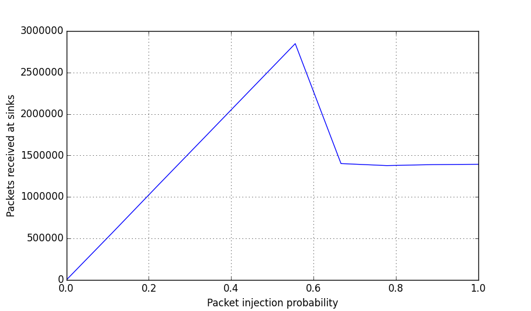

.. py:module:: network_tester

Getting started with Network Tester
===================================

This guide aims to introduce the basic concepts required to start working with
Network Tester. Complete detailed documentation can be found in the :ref:`API
documentation <api-documentation>`.

This guide introduces the key concepts and terminology used by Network Tester
and walks through the creation of a simple experiment. In this experiment we
measure how the SpiNNaker network handles the load produced by a small random
network of packet generators.

Introduction & Terminology
--------------------------

Network Tester is a Python library and native SpiNNaker application which
generates artificial network traffic in SpiNNaker while recording network
performance metrics. In particular, network tester is designed to recreate
traffic loads similar to neural applications running on SpiNNaker. This means
that the connectivity of a network loads remains fixed throughout experiments
but the rate and pattern of injected packets can be varied.

A Network Tester 'experiment' consists of a network description along with a
series of experimental 'groups' during which different traffic patterns or
network parameters are applied in sequence.

A network is described as a set of cores between which multicast flows of
packets exist. Each flow is sourced by a traffic generator in one core and sunk
by traffic consumers in another set of cores. A single core may source and sink
many flows simultaneously and thus may contain multiple traffic generators and
traffic consumers.

Each experimental group consists of a period of traffic generation and
consumption according to a particular set of parameters. A typical experiment
may consist of several groups with a single parameter being changed between
groups. Various metrics (including packet counts and router diagnostic
counters) can be recorded individually for each group and then collected after
the experiment into easily manipulated Numpy arrays.

Once an experiment has been defined, Network Tester will automatically load and
configure traffic generation software onto a target SpiNNaker machine and
execute each experimental group in sequence before collecting results.

Installation
------------

The latest stable version of Network Tester library may be installed from PyPI_
using::

    $ pip install network_tester

.. _PyPI: https://pypi.python.org/pypi/network_tester

The standard installation includes precompiled SpiNNaker binaries and should be
ready to use 'out of the box'.

Defining a network
------------------

First we must create a new :py:class:`Experiment` object which takes a
SpiNNaker IP address or hostname as its argument::

    >>> from network_tester import Experiment
    >>> e = Experiment("192.168.240.253")

The first task when defining an experiment is to define a set of cores and
flows of network traffic between them. In this example we'll create a network
with 64 cores with random flows between them. First the cores are created using
:py:meth:`~Experiment.new_core`::

    >>> cores = [e.new_core() for _ in range(64)]

Next we create a single flow for each core using
:py:meth:`~Experiment.new_flow` which connects to eight randomly selected
cores::

    >>> import random
    >>> flows = [e.new_flow(core, random.sample(cores, 8))
    ...          for core in cores]

By default, the cores and flows we've defined will be automatically placed and
routed in the SpiNNaker machine before we run the experiment.  To manually
specify which chip each core is added to, this can be given as arguments to
:py:meth:`~Experiment.new_core`, for example ``e.new_core(1, 2)`` would create
a core on chip (1, 2). For greater control over the place and route process,
see :py:meth:`~Experiment.run`.

Controling packet generation
----------------------------

Every flow has its own traffic generator on its source core. These traffic
generators can be configured to produce a range of different traffic patterns
but in this example we'll configure the traffic generators to produce a simple
Bernoulli_ traffic pattern. In a Bernoulli distribution, each traffic generator
will produce a single packet (or not) with a specific probability at a regular
interval (the 'timestep'). By varying the probability of a packet being
generated we can change the load our simple example exerts on the SpiNNaker
network.

.. _Bernoulli: https://en.wikipedia.org/wiki/Bernoulli_distribution

The timestep and packet generation probability are examples of some of the
:ref:`experimental parameters <experimental-parameters>` which can be
controlled and varied during an experiment. These parameters can be controlled
by setting attributes of the :py:class:`Experiment` object or :py:class:`Core`
and :py:class:`Flow` objects returned by :py:meth:`~Experiment.new_core` and
:py:meth:`~Experiment.new_flow` respectively.

In our example we'll set the :py:attr:`~Experiment.timestep` to 10 microseconds
meaning the packet generators in the experiment *may* generate a packet every
10 microseconds::

    >>> e.timestep = 1e-5  # 10 microseconds (in seconds)

In our example experiment we'll change the probability of a packet being
generated (thus changing the network load) and see how the network behaves. To
do this we'll create a number of experimental groups with different
probabilities::

    >>> num_steps = 10
    >>> for step in range(num_steps):
    ...     with e.new_group() as group:
    ...         e.probability = step / float(num_steps - 1)
    ...         group.add_label("probability", e.probability)

The :py:meth:`~Experiment.new_group` method creates a new experimental
:py:class:`Group` object. When a :py:class:`Group` object is used with a
``with`` statement it causes any parameters changed inside the ``with`` block
to apply only to that experimental group. In this example we set the
:py:attr:`~Experiment.probability` parameter to a different value for each
group.

The :py:meth:`Group.add_label` call is optional but adds a custom extra column
to the results collected by Network Tester. In this case we add a "probability"
column which we set to the probability used in that group. Though the results
are automatically broken up into groups, this extra column makes it much easier
to plot data straight out of the tool.

.. note::
    
    Some parameters such as :py:attr:`~Experiment.timestep` are 'global' (i.e.
    they're the same for every flow and core) and thus can only changed
    experiment-wide. Other parameters, such as :py:attr:`~Flow.probability` can
    be set individually for different cores or flows. As a convenience,
    setting these parameters on the :py:class:`Experiment` object sets the
    'default' value for all cores or flows. For example::
    
        >>> for flow in flows:
        ...     flow.probability = 0.5
    
    Is equivilent to::
    
        >>> e.probability = 0.5

One last detail is to specify how long to run the traffic generators for each
group using :py:attr:`~Experiment.duration`::

    >>> e.duration = 0.1  # Run each group for 1/10th of a second

In experiments with highly static network loads it is important to 'warm up'
the network to allow it to reach a stable state before recording results for
each group. Such a warmup can be added using :py:attr:`~Experiment.warmup`::

    >>> e.warmup = 0.05  # Warm up without recording results for 1/20th of a second

Finally, Network Tester does not attempt to maintain clock synchronisation in
long experiments in large SpiNNaker machines. As a result, some traffic
generators may finish before others causing artefacts in the results. To help
alleviate this a 'cool down' period can be added after each group using the
:py:attr:`~Experiment.cooldown` parameter. During the cool down period the
traffic generators continue to run but no further results are recorded. ::

    >>> e.cooldown = 0.01  # Cool down without recording results for 1/100th of a second

A complete list of the available parameters is :ref:`available in the API
documentation <experimental-parameters>`.

Recording results
-----------------

Various metrics may be recorded during an experiment. In our example we'll
simply record the number of packets received by the sinks of each flow.
Attributes of the :py:class:`Experiment` object whose names start with
``record_`` are used to select what metrics are recorded, in this case we
enable :py:attr:`~Experiment.record_received`::

    >>> e.record_received = True

The full set of recordable metrics is :ref:`enumerated in the API documentation
<metric-recording>` and includes per-flow packet counts, router diagnostic
counters and packet reinjection statistics.

By default, the recorded metrics are sampled once at the end of each
experimental group's execution but they can alternatively be sampled at a
regular interval (see the :py:attr:`~Experiment.record_interval` parameter).

.. note::
    
    Unlike the experimental parameters, the set of recorded metrics is fixed
    for the whole experiment and cannot be changed within groups. Further,
    individual flows, cores or router's metrics cannot be enabled and disabled
    individually. Note, however, that :py:attr:`~Experiment.record_interval` is
    an experimental parameter and thus *can* be set independently for each
    group.

Running the experiment and plotting results
-------------------------------------------

Once everything has been defined, the experiment is started using
:py:meth:`~Experiment.run`::

    >>> results = e.run(ignore_deadline_errors=True)

Note that the ``ignore_deadline_errors`` option is enabled for this experiment.
This is necessary since when the injected load is very high the load on the
traffic sinks causes the Network Tester to miss its realtime deadlines. In
experiments where the network is not expected to saturate this option should
*not* be used.

.. note::
    
    Running an experiment can take some time. To see informational messages
    indicating progress you can enable INFO messages in the Python
    :py:mod:`logging` module before calling :py:meth:`~Experiment.run`::
    
        >>> import logging
        >>> logging.basicConfig(level=logging.INFO)

The returned :py:class:`Results` object provides a number of methods which
present the recorded data in useful ways. In this case we're just interested in
the overall behaviour of the network so we'll grab the
:py:meth:`~Results.totals`::

    >>> totals = results.totals()
    >>> totals.dtype.names
    ('probability', 'group', 'time', 'received')
    >>> totals
    [(0.0, <Group 0>, 0.1, 0.0)
     (0.1111111111111111, <Group 1>, 0.1, 566026.0)
     (0.2222222222222222, <Group 2>, 0.1, 1138960.0)
     (0.3333333333333333, <Group 3>, 0.1, 1707350.0)
     (0.4444444444444444, <Group 4>, 0.1, 2277734.0)
     (0.5555555555555556, <Group 5>, 0.1, 2847388.0)
     (0.6666666666666666, <Group 6>, 0.1, 1401762.0)
     (0.7777777777777778, <Group 7>, 0.1, 1377632.0)
     (0.8888888888888888, <Group 8>, 0.1, 1389261.0)
     (1.0, <Group 9>, 0.1, 1393182.0)]

We can then plot this data using :py:mod:`~matplotlib.pyplot`::

    >>> import matplotlib.pyplot as plt
    >>> plt.plot(totals["probability"], totals["received"])
    >>> plt.xlabel("Packet injection probability")
    >>> plt.ylabel("Packets received at sinks")
    >>> plt.show()

Alternatively, we can export the data as a CSV suitable for processing or
plotting with another tool, for example R_, using the included
:py:func:`network_tester.to_csv` function::

    >>> from network_tester import to_csv
    >>> print(to_csv(totals))
    probability,group,time,received
    0.0,0,0.1,0.0
    0.1111111111111111,1,0.1,566026.0
    0.2222222222222222,2,0.1,1138960.0
    0.3333333333333333,3,0.1,1707350.0
    0.4444444444444444,4,0.1,2277734.0
    0.5555555555555556,5,0.1,2847388.0
    0.6666666666666666,6,0.1,1401762.0
    0.7777777777777778,7,0.1,1377632.0
    0.8888888888888888,8,0.1,1389261.0
    1.0,9,0.1,1393182.0

.. note::
    
    Unlike the Numpy built-in :py:func:`numpy.savetxt` function,
    :py:func:`to_csv` automatically adds headers and correctly formats missing
    elements.

.. _R: http://www.r-project.org/
